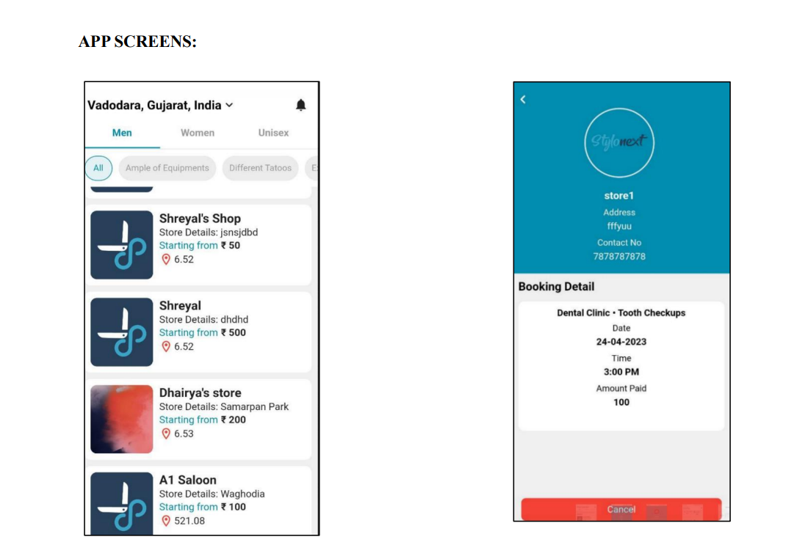
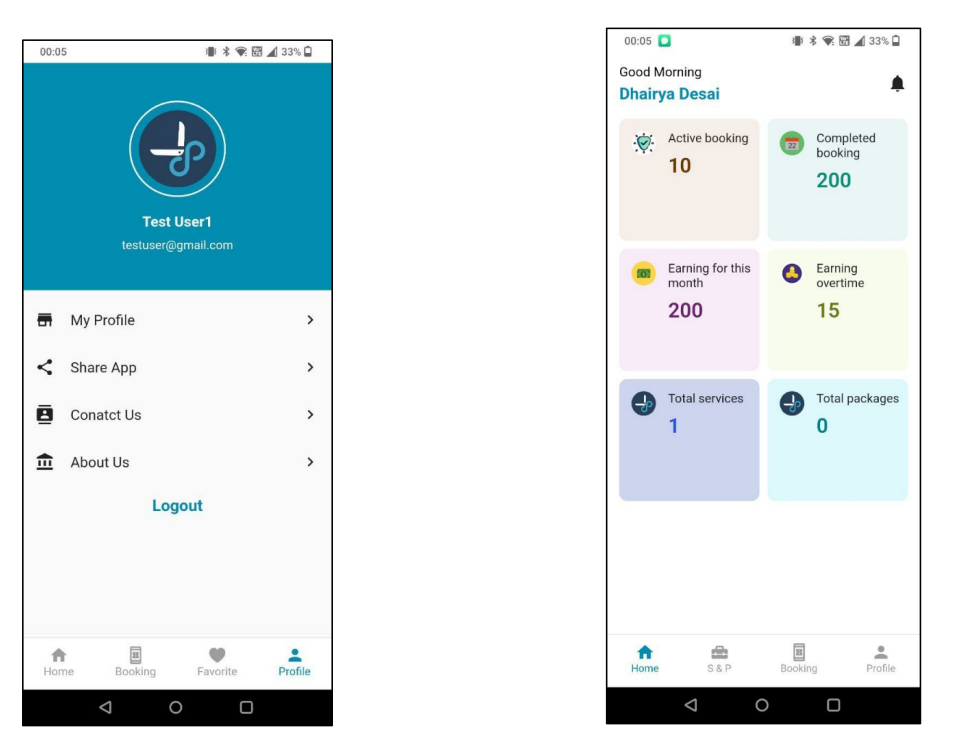
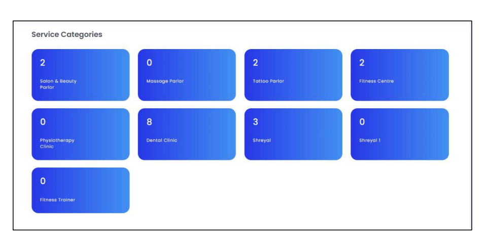
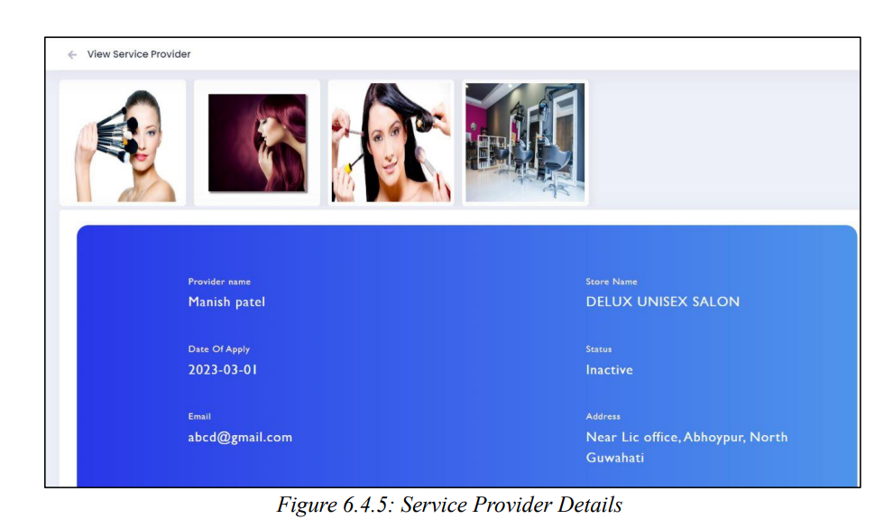

## Stylonext - A Hair Salon Application
 This application provides a convenient and hassle-free way for users to search for nearby salons, select their preferred services, and schedule an appointment with   their preferred saloon. The app also provides a secure and convenient payment gateway, allowing users to make secure online payments for their salon services.

 Link: https://play.google.com/store/apps/details?id=com.stylonext.app&pcampaignid=web_share

## Features
**Online Booking**: The application allows customers to book appointments online.      
**Appointment Management**: The application helps the salon staff to manage appointments and schedules, including rescheduling, cancellations and notifications.    
**Customer Management** : The system should allow salon staff to manage customer profiles, preferences, and history, including appointment history.    
**Payment Processing** : The system should allow customers to make payments online or in-store, including credit card payments, mobile payments, or cash.

## Scope
This App also aims to enhance the user experience by providing a range of
features, such as stylist profiles, search functionality, booking management tools,
secure payment options, and ratings and reviews. By offering these features, the app
helps users to make informed decisions when selecting salons and stylists and ensures
that the appointment booking process is streamlined and hassle-free. 

## Technologies Used
Front-End: Flutter,Dart  
Back-End: PHP,Laravel  
Database: MySQL  
Hosting: Hostinger

## Screenshots

## Contact 

For any inquiries or support, please contact at:

Email: dhairyadesai230@gmail.com
